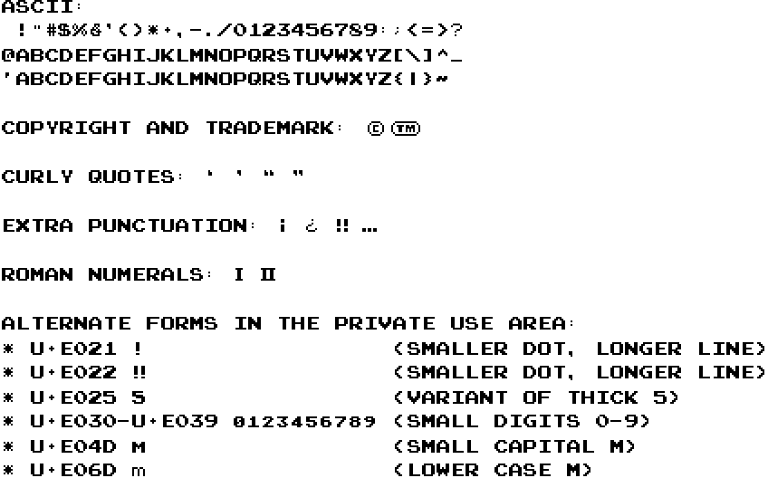

= Donkey Kong Font

The Donkey Kong arcade game has a rather limited character set, making
it simple to translate into a bitmap-ish font.  Included in +Donkey
Kong.otf+ is a scalable font that includes the entire set of printable
ASCII characters, curly quote variants in both single and double
versions, upside down exclamation, upside down question mark, double
exclamation mark, ellipsis, and the roman numerals I and II.  Upper
case letters are copy+pasted into the lower case segment of the font;
inventing new lower case letters breaks into large creative choices
that would deviate too far from the original set.

+Donkey Kong AC.otf+ is the same characters, but aspect corrected to
look visually identical to the game’s display once the pixels are
stretched to a 3:4 monitor aspect (the game used a standard TV turned
sideways).

== Included characters

The entire printable ASCII set is included, albeit upper case and
lower case characters are identical.

ASCII characters:
..................................................
 !"#$%&'()*+,-./0123456789:;<=>?
@ABCDEFGHIJKLMNOPQRSTUVWXYZ[\]^_
`abcdefghijklmnopqrstuvwxyz{|}~
..................................................

Copyright and trademark: © ™

Curly quotes: ‘ ’ “ ”

Extra punctuation: ¡ ¿ ‼ …

Roman numerals: Ⅰ Ⅱ

Alternate forms in the private use area:

* Single and double exclamation marks at U+E021 and U+E022 (longer
  line and smaller dot)
* Variant of thick 5 at U+E025
* Small versions of 0-9 at U+E030 through U+E039
* Variant of M at U+E04D
* Lower case m at U+E06D

=== Preview

== The game’s original tile set

Donkey Kong’s graphics are not complete enough to represent the entire
ASCII set.  Most characters in the game use thick strokes, keeping
single-pixel details and single-pixel strokes rare in the game (likely
influenced by needing to be legible on a blurry TV buried in the
cabinet).  One large and notable exception is the question mark,
entirely made out of single-pixel strokes.

In the original game, the digits 0-9, upper case letters A-Z, period,
hyphen, comma, colon, exclamation mark (single and double), question
mark, parentheses, equals sign, and roman numerals I and II are within
the graphics tiles.  There are three variants of numbers, even: a
thick version without a slashed zero used for score displays; a
smaller version used for displaying the board in terms of meters; and
a copy of the thick numbers with a different stroke in the middle of
5, used in the bonus timer when it counts below 1000 (I don’t know why
the game does this).  The smaller numbers include the complete set,
even though they do not all appear on screen for the display of “25m”,
“50”, “75m”, “100m”.  The small “m” is likewise the only lower case
letter represented in the game’s graphics.

== New character forms

Given limitations of the game’s original tile set, some creativity had
to be employed to fill out the printable ASCII set.

* # was created by just drawing four single-pixel lines.  I believe it
came out well and consistent with the game’s style.

* $ is simply the letter S with a line drawn through it.  The original
S is already seven pixels tall and the game avoids drawing on the
bottom line, and keeping these constrains did not allow for the
typical style of the middle bar protuding from the top and bottom.

* / was drawn as a simple line extending from the bottom-left corner
to the top-right corner, with a two-pixel stroke.

* \ is the same as /, in reverse.

* % was created by taking the /, and drawing small circles in the
corners.

* & may be the most creative character in this set, and the workable
8×7 area to draw in does not leave much opportunity to create this in
a double-pixel stroke.  The character has a bit of 6's bottom in it,
and you can just about make out the “e” and “t” that the ampersand was
derived from in normal typography.

* * was created by placing a 9-pixel dot and surrounding the corners
and sides with single pixels around it.

* ; is a modified :, adding a third pixel below the bottom.  I had
experimented with making the comma a continuous three pixels, did not
like it.

* < is a variant of the ( character, angled out a bit sharper.

* > is a reversed <.

* @ is a modified letter O; a hole was created in the corner and the
remnants of a small “A” fills the space.

* ` (backtick) is the ' (single-quote) character reversed.

* [ was a simple angle bracket to make, using a thick stroke verticle
and centered where the letters are centered.

* ] is a reversed [.

* _ (underscore) was the hyphen moved down.

* { was modified from the ( symbol, pushing the middle inwards to
create a curly brace.

* } is a reversed {.

* ~ took a couple iterations, but I am happy with a thick tilde that
still has a visible down→up→down→up motion to it.

* ¡ and ¿ are 180° rotations of the ASCII characters.

* … is simply drawing three periods in the 8×8 pixel grid.

* Curly-quote variations of the single and double quote characters
were modified from the ASCII versions.

== Building

I am no expert in font creation and this process was a lot more
involved than I expected it to be.

The game’s graphics were ripped by using the “tools/gfxrip/gfxrip.py”
program from https://github.com/furrykef/dkdasm/ and viewed in MtPaint
(which offers a convenient grid to count pixels).

I abused Unifont’s source and build system to create the final
product.  The basic process is as such:

1. Use src/unihex2png to create blank pages (`src/unihex2png -o
   donkeykong-00.png < /dev/null`)

2. Edit the blank page by copying and redrawing into the cells.
   Unifont’s normal lettering was used to inform me of where
   characters should be drawn.

3. After everything is drawn, combine them into a single file (`cat
   space.hex donkeykong-??.hex > donkeykong.hex`).

4. Use src/hex2sfd to convert it into FontForge’s source format
   (`src/hex2sfd < donkeykong.hex > donkeykong.sfd`).  Edit the
   resulting (plain text!) file to change the font name and remove the
   Unifont copyright notice (I’m using their tools, not their glyphs).

5. Open in FontForge, use “Encoding → Compact” for convenience.

6. Select all the characters.

7. “Element → Overlap → Remove Overlap”

8. “Element → Simplify → Simplify”

9. “Element → Correct Direction”

10. “File → Generate Fonts”, make an OpenType (OTF) font, ignore errors.

11. ???

12. Profit!

There’s a high probability that a solution superior to the one I took
exists, and if someone can do better, go for it.

== Copyright

Donkey Kong is © 1981 by Nintendo.

As such, I claim no copyright over the characters ripped from the game.

I also disclaim copyright protection of original characters as
described in the “New character forms” section.  Go wild.  :)
